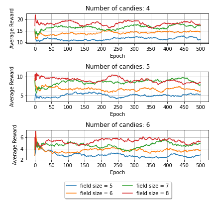

# Play Candy Crush by applying Deep Reinforcement Learning
# "Large Action Spaces are Problematic in Deep Reinforcement Learning"
## by Marc Zeller, Robin Gratz and Tim Niklas Witte 

This repository contains three approaches to play the game Candy Crush.
These three approaches are a Deep Q-Network (DQN), a Proximal Policy Optimization (PPO) algorithm
and a Decision Transformer.
This repository also contains a parameterizable Candy Crush field size and number of candies.
It turn out that DQN and PPO are unable to learn the Candy Crush game.
Only the Decision Transformer is able to learn it.

## Requirements
- TensorFlow 2
- Numpy
- tkinter
- matplotlib
- argparse
- imageio
- pyautogui

## Results

### DQN
#### Average Reward

#### Score

### PPO
#### Average Reward

#### Score

### Decision Transformer
#### Training (Accuracy on test dataset)

#### Error of desired reward and achieved reward (absolute value)
